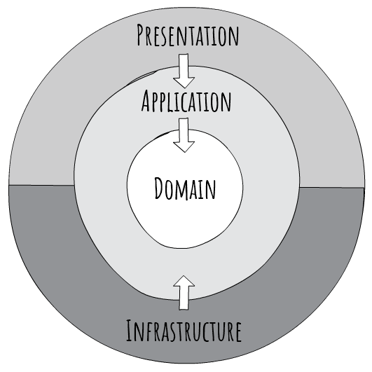

# iUGOCare Patient Portal (v5)

## Table of Contents

* [Project Links](#project-links)
* [Technology Stack](#used-technology-stack)
* [Prerequisites](#prerequisites)
* [Running the Application](#run-the-application)
* [Database Migrations](#database-migrations)
* [Architecture](#architecture)

**[Guide](MACOS_SETUP.md) For Macos Users**

## Project Links

* [GitHub Project](https://github.com/reliqhealth/iugocare)
* [CI/CD Development System](https://reliqv5dev.azurewebsites.net/) - deployed on every merge to master
* [iUGO Patient Portal](https://reliqhealth.atlassian.net/browse/IV5) Jira project
* [Project Requirements](https://reliqhealth.atlassian.net/wiki/spaces/iUGO/pages/604602383/iUGO+v5+Patient+Portal+-+Requirements) in Confluence
* [Developer Notes](https://reliqhealth.atlassian.net/wiki/spaces/iUGO/pages/607421673/Development+Documentation) in Confluence
* Azure Dev-Ops [CI/CD Build](https://dev.azure.com/reliqhealth/reliq-api/_build?definitionId=37)
* Azure Dev-Ops [CI/CD Release Pipeline](https://dev.azure.com/reliqhealth/reliq-api/_release?_a=releases&view=mine&definitionId=21)


## Technology Stack

**ASP.NET Core 3.1:**

* Web.API
* Vue CLI and JavaScript Services middlewares to integrate with client app
* CQRS pattern implemented using [MediatR](https://github.com/jbogard/MediatR)
* [NSwag](https://github.com/RicoSuter/NSwag) automatically creates Swagger documentation and generates the TypeScript API client
* Testing with [NUnit](https://nunit.org) and [Moq](https://github.com/Moq/moq4/wiki/Quickstart)

**Vue.js with CLI 4.0**

* [TypeScript](https://www.typescriptlang.org/)
* Progressive Web App
* Vue Router & [Vuex](https://vuex.vuejs.org/) (State Store)
* Linting, unit testing, E2E testing
* [Vuetify](https://vuetifyjs.com/en/) 3rd party component framework

## Prerequisites

### Required

* [.NET Core](https://www.microsoft.com/net/download/windows) >= 3.1
* [EF Core Tools](https://docs.microsoft.com/en-us/ef/core/miscellaneous/cli/dotnet)
* [NodeJS](https://nodejs.org/) >= 12.16 LTS
* [Vue CLI](https://cli.vuejs.org/) >= 4.0
* [VS Code](https://code.visualstudio.com/), or [Visual Studio 2019](https://visualstudio.microsoft.com/)

### User Secrets and/or Environment Variables

When developing the application, secrets can be set in User Secrets or Environment variables. To set User Secrets, right click on the **IUGOCare.API** project or the **IUGOCare.Application.Integration.Tests** projects and select **Manage User Secrets**.

The following values may be set for those projects as user secrets or environment variables.

1. Open the solution in Visual Studio
2. Right-Click on `IUGOCare.API`
3. Select "Manage User Secrets"
4. Paste the following:

```json
{
  "SendGridApiKey": "<FILL IN>",
  "Auth0ManagementClientId": "<FILL IN>",
  "Auth0ManagementSecret": "<FILL IN>",
  "IsServiceBusEnabled": "true",
  "ServiceBusConnectionString": "<FILL IN>",
  "SystemFailureNotificationRecipient": "rprouse+systemNotifications@reliqhealth.com"
}
```

5. Log into Auth0 (ensure you're in the reliqhealth-dev tenant)
6. Navigate to Applications -> API Management Application
7. Set the Client ID & Client Secret as appropriate into your secrets file

### Internal NuGet Packages

1. Open Windows PowerShell.
2. Navigate to the `IUGOCare` directory.
3. Paste and run the following command:
```
iex "& { $(irm https://aka.ms/install-artifacts-credprovider.ps1) } -AddNetfx"
```

### Recommended browser plugin for debugging Vue

* [Chrome DevTools for Vue.js](https://chrome.google.com/webstore/detail/vuejs-devtools/nhdogjmejiglipccpnnnanhbledajbpd)

### Recommended VS Code Plugins

* [C#](https://marketplace.visualstudio.com/items?itemName=ms-dotnettools.csharp)
* [EditorConfig for VS Code](https://marketplace.visualstudio.com/items?itemName=EditorConfig.EditorConfig)
* [Remote Development](https://marketplace.visualstudio.com/items?itemName=ms-vscode-remote.vscode-remote-extensionpack)
* [Sass](https://marketplace.visualstudio.com/items?itemName=Syler.sass-indented)
* [Vetur](https://marketplace.visualstudio.com/items?itemName=octref.vetur)
* [Vue VSCode Snippets](https://marketplace.visualstudio.com/items?itemName=sdras.vue-vscode-snippets)

### Recommended Visual Studio Extensions

* [Vue.js Pack 2019](https://marketplace.visualstudio.com/items?itemName=MadsKristensen.VuejsPack2019)

## Run the application

You have three choices when it comes to how you prefer to run the app. You can either use the command line or the build-in run command.

### 1. Using the command line

* Run the .NET application using `dotnet run --project .\IUGOCare.API\IUGOCare.API.csproj`

### 2. Using the built-in run command

* Run the application in VSCode or Visual Studio 2017 by hitting `F5`

> It will take some time during the first run to download all client side dependencies.

### 3. Using docker

_Please note that running in Docker does not currently set up the Vue watchers._

* Run the following command in a cmd window to build the docker image:
`docker build -t <IMAGE_NAME> .`

* Run the application in a cmd window by this command:
`docker run -p 80:80 <IMAGE_NAME>`

## View your application running

Browse to [http://localhost:5000](http://localhost:5000) for ASP.&#8203;NET Core + Vue app or browse to [http://localhost:8080](http://localhost:8080) for Vue app only.

## Database Migrations

To perform migrations on the command line, you will first need to install the `dotnet-ef` command line tools.

See [Entity Framework Core tools reference - .NET CLI](https://docs.microsoft.com/en-us/ef/core/miscellaneous/cli/dotnet) for more information.

    dotnet tool install --global dotnet-ef


To create a new migration, run:

    dotnet ef migrations add [MigrationName] --project .\IUGOCare.Infrastructure\ --context ApplicationDbContext --startup-project .\IUGOCare.API\ --output-dir Persistence\Migrations

To run your migrations, run:

    dotnet ef database update --project .\IUGOCare.Infrastructure\ --context ApplicationDbContext --startup-project .\IUGOCare.API\

To run the Audit project migrations, run:

	dotnet ef database update --project .\IUGOCare.Audit\ --context AuditDbContext --startup-project .\IUGOCare.API\

This is obviously not optimal. Hopefully we can create a script to handle some of these defaults.

## Architecture

This project uses the Clean Architecture pattern.



### Learning Resources

* [GOTO 2019 • Clean Architecture with ASP.NET Core 3.0 • Jason Taylor](https://www.youtube.com/watch?v=dK4Yb6-LxAk)
* [Clean Architecture with .NET Core: Getting Started](https://jasontaylor.dev/clean-architecture-getting-started/)
* [Clean Architecture with ASP.NET Core 3.0 - Jason Taylor - NDC Sydney 2019](https://www.youtube.com/watch?v=5OtUm1BLmG0)
* [Clean Testing: Clean Architecture with .NET Core](https://www.youtube.com/watch?v=2UJ7mAtFuio)
* [Rules to Better Clean Architecture](https://rules.ssw.com.au/rules-to-better-clean-architecture)
* [Architecting Modern Web Applications with ASP.NET Core and Microsoft Azure](https://docs.microsoft.com/en-us/dotnet/architecture/modern-web-apps-azure/) free e-book
* [Clean Architecture Solution Template](https://github.com/jasontaylordev/CleanArchitecture)
* [NorthwindTraders](https://github.com/jasontaylordev/NorthwindTraders) sample application
* [[.NET Core] Using CQRS pattern with MediatR [Part 1]](https://medium.com/@ducmeit/net-core-using-cqrs-pattern-with-mediatr-part-1-55557e90931b)
* [[.NET Core] Using CQRS pattern with MediatR [Part 2]](https://medium.com/@ducmeit/net-core-using-cqrs-pattern-with-mediatr-part-2-cc55763e83f0)
* This project is based on the [ASP.NET Core Vue Starter template](). A good overview of the template and getting started with Vue can be found in the post [ASP.NET Core Vue template with custom configuration using CLI 3.0](https://medium.com/software-ateliers/asp-net-core-vue-template-with-custom-configuration-using-cli-3-0-8288e18ae80b)
